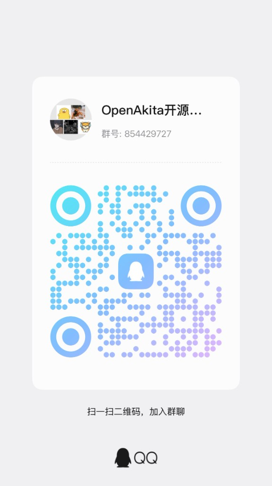

<p align="center">
  
</p>

<h1 align="center">OpenAkita</h1>

<p align="center">
  <strong>Open-Source Multi-Agent AI Assistant — Not Just Chat, an AI Team That Gets Things Done</strong>
</p>

<p align="center">
  
  
  
  
  
</p>

<p align="center">
  Multi-Agent Collaboration · 30+ LLMs · 6 IM Platforms · 89+ Tools · GUI Setup, Zero Command Line
</p>

<p align="center">
  <a href="#core-capabilities">Capabilities</a> •
  <a href="#5-minute-setup">5-Min Setup</a> •
  <a href="#desktop-app">Desktop App</a> •
  <a href="#multi-agent-collaboration">Multi-Agent</a> •
  <a href="#documentation">Docs</a>
</p>

<p align="center">
  <strong>English</strong> | <a href="README_CN.md">中文</a>
</p>

---

## What is OpenAkita?

**Other AIs just chat. OpenAkita gets things done.**

OpenAkita is an open-source, all-in-one AI assistant — multiple AI Agents work together, search the web, operate your computer, manage files, run scheduled tasks, and respond instantly across Telegram / Slack / DingTalk / Feishu / QQ. It remembers your preferences, teaches itself new skills, and never gives up on a task.

**Fully GUI-based setup. Ready in 5 minutes. Zero command line required.**

> **Download**: [GitHub Releases](https://github.com/openakita/openakita/releases) — Windows / macOS / Linux

---

## Core Capabilities

<table>
<tr><td>

### 🤝 Multi-Agent Collaboration
Multiple AI agents with specialized skills work in parallel.
Say one thing — a coding Agent writes code, a writing Agent drafts docs, a testing Agent verifies — all at the same time.

### 📋 Plan Mode
Complex tasks auto-decomposed into step-by-step plans with real-time progress tracking and automatic rollback on failure.

### 🧠 ReAct Reasoning Engine
Think → Act → Observe. Explicit three-phase reasoning with checkpoint/rollback. Fails? Tries a different strategy.

### 🔧 89+ Tools — Actually Does Things
Web search · Desktop automation · File management · Browser automation · Scheduled tasks · MCP extensions …

</td><td>

### 🚀 5-Min Setup — Zero Command Line
Download → Install → Follow the wizard → Enter API Key → Start chatting. Fully GUI-based, no terminal needed.

### 🌐 30+ LLM Providers
DeepSeek / Qwen / Kimi / Claude / GPT / Gemini … One goes down, the next picks up automatically.

### 💬 6 IM Platforms
Telegram / Feishu / WeCom / DingTalk / QQ / OneBot — use AI right inside your daily chat tools.

### 💾 Long-Term Memory
Three-layer memory system + AI extraction. Remembers your preferences, habits, and task history.

</td></tr>
</table>

---

## Full Feature List

| | Feature | Description |
|:---:|---------|-------------|
| 🤝 | **Multi-Agent** | Specialized agents, parallel delegation, automatic handoff, failover, real-time visual dashboard |
| 📋 | **Plan Mode** | Auto task decomposition, per-step tracking, floating progress bar in UI |
| 🧠 | **ReAct Reasoning** | Explicit 3-phase loop, checkpoint/rollback, loop detection, strategy switching |
| 🚀 | **Zero-Barrier Setup** | Full GUI config, onboarding wizard, 5 minutes from install to chat, zero CLI |
| 🔧 | **89+ Built-in Tools** | 16 categories: Shell / Files / Browser / Desktop / Search / Scheduler / MCP … |
| 🛒 | **Skill Marketplace** | Search & one-click install, GitHub direct install, AI-generated skills on the fly |
| 🌐 | **30+ LLM Providers** | Anthropic / OpenAI / DeepSeek / Qwen / Kimi / MiniMax / Gemini … smart failover |
| 💬 | **6 IM Platforms** | Telegram / Feishu / WeCom / DingTalk / QQ / OneBot, voice recognition, smart group chat |
| 💾 | **3-Layer Memory** | Working + Core + Dynamic retrieval, 7 memory types, AI-driven extraction & review |
| 🎭 | **8 Personas** | Default / Tech Expert / Boyfriend / Girlfriend / Jarvis / Butler / Business / Family |
| 🤖 | **Proactive Engine** | Greetings, task follow-ups, idle chat, goodnight — adapts frequency to your feedback |
| 🧬 | **Self-Evolution** | Daily self-check & repair, failure root cause analysis, auto skill generation |
| 🔍 | **Deep Thinking** | Controllable thinking mode, real-time chain-of-thought display, IM streaming |
| 🛡️ | **Runtime Supervision** | Tool thrashing detection, resource budgets, policy engine, deterministic validators |
| 🔒 | **Safety & Governance** | POLICIES.yaml, dangerous ops require confirmation, local data storage |
| 🖥️ | **Desktop App** | Tauri 2.x cross-platform, 11 panels, dark theme, auto-update |
| 📊 | **Observability** | 12 trace span types, full-chain token statistics panel |
| 😄 | **Stickers** | 5700+ stickers, mood-aware, persona-matched |

---

## 5-Minute Setup

### Option 1: Desktop App (Recommended)

**Fully GUI-based, no command line** — this is what sets OpenAkita apart from other open-source AI assistants:

<p align="center">
  
</p>

| Step | What You Do | Time |
|:----:|-------------|:----:|
| 1 | Download installer, double-click to install | 1 min |
| 2 | Follow the onboarding wizard, enter API Key | 2 min |
| 3 | Start chatting | Now |

- No Python installation, no git clone, no config file editing
- Isolated runtime — won't mess with your existing system
- Chinese users get automatic mirror switching
- Models, IM channels, skills, schedules — all configured in the GUI

> **Download**: [GitHub Releases](https://github.com/openakita/openakita/releases) — Windows (.exe) / macOS (.dmg) / Linux (.deb)

### Option 2: pip Install

```bash
pip install openakita[all]    # Install with all optional features
openakita init                # Run setup wizard
openakita                     # Launch interactive CLI
```

### Option 3: Source Install

```bash
git clone https://github.com/openakita/openakita.git
cd openakita
python -m venv venv && source venv/bin/activate
pip install -e ".[all]"
openakita init
```

### Commands

```bash
openakita                              # Interactive chat
openakita run "Build a calculator"     # Execute a single task
openakita serve                        # Service mode (IM channels)
openakita serve --dev                  # Dev mode with hot reload
openakita daemon start                 # Background daemon
openakita status                       # Check status
```

---

## Desktop App

<p align="center">
  
</p>

Cross-platform desktop app built with **Tauri 2.x + React + TypeScript**:

| Panel | Function |
|-------|----------|
| **Chat** | AI chat, streaming output, Thinking display, drag & drop upload, image lightbox |
| **Agent Dashboard** | Neural network visualization, real-time multi-Agent status tracking |
| **Agent Manager** | Create, manage, and configure multiple Agents |
| **IM Channels** | One-stop setup for all 6 platforms |
| **Skills** | Marketplace search, install, enable/disable |
| **MCP** | MCP server management |
| **Memory** | Memory management + LLM-powered review |
| **Scheduler** | Scheduled task management |
| **Token Stats** | Token usage statistics |
| **Config** | LLM endpoints, system settings, advanced options |
| **Feedback** | Bug reports + feature requests |

Dark/light theme · Onboarding wizard · Auto-update · Bilingual (EN/CN) · Start on boot

---

## Multi-Agent Collaboration

OpenAkita has a built-in multi-Agent orchestration system — not just one AI, but an **AI team**:

```
You: "Create a competitive analysis report"
    │
    ▼
┌──────────────────────────────────────┐
│      AgentOrchestrator (Director)     │
│   Decomposes task → Assigns to Agents │
└───┬────────────┬──────────────┬──────┘
    ▼            ▼              ▼
 Search Agent  Analysis Agent  Writing Agent
 (web research) (data crunching) (report drafting)
    │            │              │
    └────────────┴──────────────┘
                 ▼
         Results merged, delivered to you
```

- **Specialization**: Different Agents for different domains, auto-matched to tasks
- **Parallel Processing**: Multiple Agents work simultaneously
- **Auto Handoff**: If one Agent gets stuck, it hands off to a better-suited one
- **Failover**: Agent failure triggers automatic switch to backup
- **Depth Control**: Max 5 delegation levels to prevent runaway recursion
- **Visual Tracking**: Agent Dashboard shows real-time status of every Agent

---

## 30+ LLM Providers

**No vendor lock-in. Mix and match freely:**

| Category | Providers |
|----------|-----------|
| **Local** | Ollama · LM Studio |
| **International** | Anthropic · OpenAI · Google Gemini · xAI (Grok) · Mistral · OpenRouter · NVIDIA NIM · Groq · Together AI · Fireworks · Cohere |
| **China** | Alibaba DashScope · Kimi (Moonshot) · MiniMax · DeepSeek · SiliconFlow · Volcengine · Zhipu AI · Baidu Qianfan · Tencent Hunyuan · Yunwu · Meituan LongCat · iFlow |

**7 capability dimensions**: Text · Vision · Video · Tool use · Thinking · Audio · PDF

**Smart failover**: One model goes down, the next picks up seamlessly.

### Recommended Models

| Model | Provider | Notes |
|-------|----------|-------|
| `claude-sonnet-4-5-*` | Anthropic | Default, balanced |
| `claude-opus-4-5-*` | Anthropic | Most capable |
| `qwen3-max` | Alibaba | Strong Chinese support |
| `deepseek-v3` | DeepSeek | Cost-effective |
| `kimi-k2.5` | Moonshot | Long-context |
| `minimax-m2.1` | MiniMax | Great for dialogue |

> For complex reasoning, enable Thinking mode — add `-thinking` suffix to the model name.

---

## 6 IM Platforms

Talk to your AI right inside the chat tools you already use:

| Platform | Connection | Highlights |
|----------|-----------|------------|
| **Telegram** | Webhook / Long Polling | Pairing verification, Markdown, proxy support |
| **Feishu** | WebSocket / Webhook | Card messages, event subscriptions |
| **WeCom** | Smart Robot callback | Streaming replies, proactive push |
| **DingTalk** | Stream WebSocket | No public IP needed |
| **QQ Official** | WebSocket / Webhook | Groups, DMs, channels |
| **OneBot** | WebSocket | Compatible with NapCat / Lagrange / go-cqhttp |

- 📷 **Vision**: Send screenshots/photos — AI understands them
- 🎤 **Voice**: Send voice messages — auto-transcribed and processed
- 📎 **File Delivery**: AI-generated files pushed directly to chat
- 👥 **Group Chat**: Replies when @mentioned, stays quiet otherwise
- 💭 **Chain-of-Thought**: Real-time reasoning process streamed to IM

---

## Memory System

Not just a "context window" — true long-term memory:

- **Three layers**: Working memory (current task) + Core memory (user profile) + Dynamic retrieval (past experience)
- **7 memory types**: Fact / Preference / Skill / Error / Rule / Persona trait / Experience
- **AI-driven extraction**: Automatically distills valuable information after each conversation
- **Multi-path recall**: Semantic + full-text + temporal + attachment search
- **Gets smarter over time**: Preferences you mentioned two months ago? Still remembered.

---

## Self-Evolution

OpenAkita keeps getting stronger:

```
Daily 04:00   →  Self-check: analyze error logs → AI diagnosis → auto-fix → push report
After failure →  Root cause analysis (context loss / tool limitation / loop / budget) → suggestions
Missing skill →  Auto-search GitHub for skills, or AI generates one on the spot
Missing dep   →  Auto pip install, auto mirror switching for China
Every chat    →  Extract preferences and experience → long-term memory
```

---

## Safety & Governance

- **Policy Engine**: POLICIES.yaml for tool permissions, shell command blocklist, path restrictions
- **Confirmation**: Dangerous operations (file deletion, system commands) require user approval
- **Resource Budgets**: Token / cost / duration / iteration / tool call limits per task
- **Runtime Supervision**: Auto-detection of tool thrashing, reasoning loops, token anomalies
- **Local Data**: Memory, config, and chat history stored on your machine only
- **Open Source**: Apache 2.0, fully transparent codebase

---

## Architecture

```
Desktop App (Tauri + React)
    │
Identity ─── SOUL.md · AGENT.md · POLICIES.yaml · 8 Persona Presets
    │
Core     ─── ReasoningEngine(ReAct) · Brain(LLM) · ContextManager
    │        PromptAssembler · RuntimeSupervisor · ResourceBudget
    │
Agents   ─── AgentOrchestrator(Coordination) · AgentInstancePool(Pooling)
    │        AgentFactory · FallbackResolver(Failover)
    │
Memory   ─── UnifiedStore(SQLite+Vector) · RetrievalEngine(Multi-path)
    │        MemoryExtractor · MemoryConsolidator
    │
Tools    ─── Shell · File · Browser · Desktop · Web · MCP · Skills
    │        Plan · Scheduler · Sticker · Persona · Agent Delegation
    │
Evolution ── SelfCheck · FailureAnalyzer · SkillGenerator · Installer
    │
Channels ─── CLI · Telegram · Feishu · WeCom · DingTalk · QQ · OneBot
    │
Tracing  ─── AgentTracer(12 SpanTypes) · DecisionTrace · TokenStats
```

---

## Documentation

| Document | Content |
|----------|---------|
| [Configuration Guide](docs/configuration-guide.md) | Desktop Quick Setup & Full Setup walkthrough |
| ⭐ [LLM Provider Setup](docs/llm-provider-setup-tutorial.md) | **API Key registration + endpoint config + Failover** |
| ⭐ [IM Channel Setup](docs/im-channel-setup-tutorial.md) | **Telegram / Feishu / DingTalk / WeCom / QQ / OneBot tutorial** |
| [Quick Start](docs/getting-started.md) | Installation and basics |
| [Architecture](docs/architecture.md) | System design and components |
| [Configuration](docs/configuration.md) | All config options |
| [Deployment](docs/deploy.md) | Production deployment |
| [MCP Integration](docs/mcp-integration.md) | Connecting external services |
| [Skill System](docs/skills.md) | Creating and using skills |

---

## Community

<table>
  <tr>
    <td align="center">
      <br/>
      <b>WeChat Official</b><br/>
      <sub>Follow for updates</sub>
    </td>
    <td align="center">
      <br/>
      <b>WeChat (Personal)</b><br/>
      <sub>Note "OpenAkita" to join group</sub>
    </td>
    <td align="center">
      <br/>
      <b>WeChat Group</b><br/>
      <sub>Scan to join (⚠️ refreshed weekly)</sub>
    </td>
    <td align="center">
      <br/>
      <b>QQ Group: 854429727</b><br/>
      <sub>Scan or search to join</sub>
    </td>
  </tr>
</table>

<p align="center">
  <a href="https://discord.gg/vFwxNVNH">Discord</a> · 
  <a href="https://x.com/openakita">X (Twitter)</a> · 
  <a href="mailto:zacon365@gmail.com">Email</a>
</p>

[Issues](https://github.com/openakita/openakita/issues) · [Discussions](https://github.com/openakita/openakita/discussions) · [Star](https://github.com/openakita/openakita)

---

## Acknowledgments

- [Anthropic Claude](https://www.anthropic.com/claude) — Core LLM engine
- [Tauri](https://tauri.app/) — Cross-platform desktop framework
- [ChineseBQB](https://github.com/zhaoolee/ChineseBQB) — 5700+ stickers that give AI a soul
- [browser-use](https://github.com/browser-use/browser-use) — AI browser automation
- [AGENTS.md](https://agentsmd.io/) / [Agent Skills](https://agentskills.io/) — Open standards

## License

Apache License 2.0 — See [LICENSE](LICENSE)

Third-party licenses: [THIRD_PARTY_NOTICES.md](THIRD_PARTY_NOTICES.md)

## Star History

<a href="https://star-history.com/#openakita/openakita&Date">
 <picture>
   <source media="(prefers-color-scheme: dark)" srcset="https://api.star-history.com/svg?repos=openakita/openakita&type=Date&theme=dark" />
   <source media="(prefers-color-scheme: light)" srcset="https://api.star-history.com/svg?repos=openakita/openakita&type=Date" />
   
 </picture>
</a>

---

<p align="center">
  <strong>OpenAkita — Open-Source Multi-Agent AI Assistant That Gets Things Done</strong>
</p>
