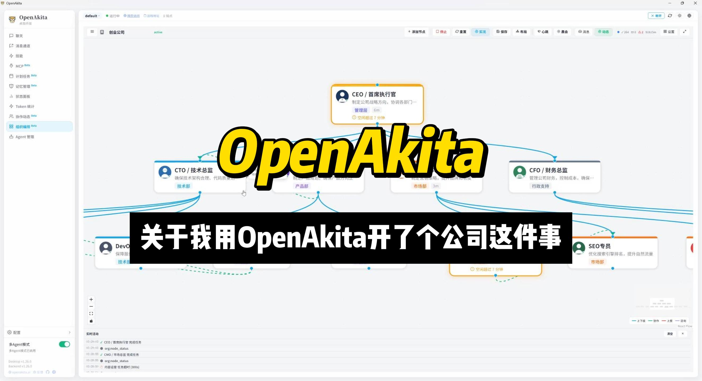
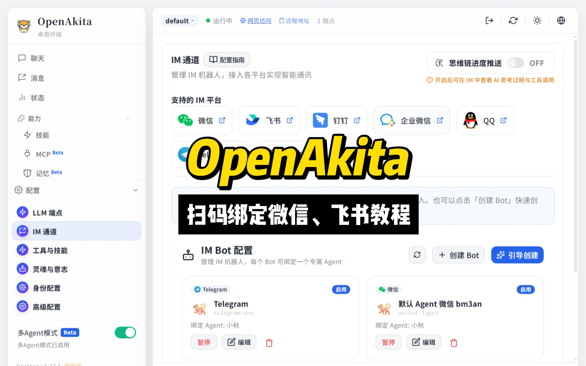

<p align="center">
  
</p>

<h1 align="center">OpenAkita</h1>

<p align="center">
  <strong>Open-Source Multi-Agent AI Assistant — Not Just Chat, an AI Team That Gets Things Done</strong>
</p>

<p align="center">
  <a href="https://openakita.ai"></a>
  &nbsp;
  <a href="https://openakita.ai/download"></a>
  &nbsp;
  <a href="https://discord.gg/vFwxNVNH"></a>
</p>

<p align="center">
  
  
  
  
  
  
</p>

<p align="center">
  Multi-Agent Collaboration · Organization Orchestration · Plugin System · Sandbox Security · 30+ LLMs · 6 IM Platforms · 89+ Tools · Desktop / Web / Mobile
</p>

<p align="center">
  <a href="#quick-start-guide">Quick-Start</a> •
  <a href="#organization-orchestration">Org Orchestration</a> •
  <a href="#im-scan-to-bind">Scan-to-Bind</a> •
  <a href="#plugin-system">Plugins</a> •
  <a href="#sandbox-security">Security</a> •
  <a href="#documentation">Docs</a>
</p>

<p align="center">
  <strong>English</strong> | <a href="README_CN.md">中文</a>
</p>

---

## What is OpenAkita?

**Other AIs just chat. OpenAkita gets things done.**

OpenAkita is an open-source, all-in-one AI assistant — multiple AI Agents work together, build an **AI company** that runs autonomously, search the web, operate your computer, manage files, run scheduled tasks, and respond instantly across Telegram / Feishu / WeCom / DingTalk / QQ. **Scan a QR code to bind your chat app in 30 seconds.** It remembers your preferences, teaches itself new skills, and never gives up on a task. Extend anything through the **plugin system**, protected by **6-layer sandbox security**.

**Fully GUI-based setup. Ready in 5 minutes. Zero command line required.**

<p align="center">
  🌐 <a href="https://openakita.ai"><b>Website openakita.ai</b></a> &nbsp;|&nbsp;
  📥 <a href="https://openakita.ai/download"><b>Download Desktop App</b></a> &nbsp;|&nbsp;
  📖 <a href="https://openakita.ai/docs"><b>Documentation</b></a> &nbsp;|&nbsp;
  💬 <a href="https://discord.gg/vFwxNVNH"><b>Discord Community</b></a>
</p>

---

## Quick-Start Guide

### 🚀 For First-Time Users (3 Minutes)

**No installation required** — download the desktop app and start chatting:

1. **Download** the installer from [GitHub Releases](https://openakita.ai/download)
2. **Install** and follow the onboarding wizard
3. **Enter your API Key** (get one from [Anthropic](https://console.anthropic.com/) or [DeepSeek](https://platform.deepseek.com/))
4. **Try your first task**: Type "Create a calculator" and watch it work

### 💻 For Developers (5 Minutes)

```bash
# Install
pip install openakita[all]

# Quick setup (interactive wizard)
openakita init

# Run your first task
openakita run "Build a weather scraper"
```

### ✨ What You Can Do Right Away

| Category | Examples |
|----------|----------|
| **💬 Chat** | Text + images + files, voice messages, stickers |
| **🤖 Multi-Agent** | "Create a competitive analysis" → research + analysis + writing agents work together |
| **🏢 Organization** | Build an AI company — CEO, CTO, marketing, finance — agents run it autonomously |
| **🌐 Web** | Search news, scrape websites, automate browser tasks |
| **📁 Files** | Read/write/edit files, batch rename, search content |
| **🖥️ Desktop** | Click buttons, type text, take screenshots, automate apps |
| **⏰ Scheduled** | "Remind me every Monday at 9am" — cron-based reminders |

### ➡️ Next Steps

- **Configure LLM**: Add multiple providers for automatic failover
- **Set up IM channels**: Scan QR code to bind WeChat/Feishu/WeCom in 30 seconds
- **Explore skills**: Install from marketplace or create your own
- **Try org mode**: Build an AI company and watch it run
- **Join community**: [Discord](https://discord.gg/vFwxNVNH) | [WeChat Group](docs/assets/wechat_group.jpg)

---

## Core Capabilities

<table>
<tr><td>

### 🤝 Multi-Agent Collaboration
Multiple AI agents with specialized skills work in parallel.
Say one thing — a coding Agent writes code, a writing Agent drafts docs, a testing Agent verifies — all at the same time.

### 🏢 Organization Orchestration
Not just multi-Agent — build an **AI company**. CEO, CTO, CFO, marketing director… each role operates independently. Blackboard sharing, message routing, deadlock detection.

### 📋 Plan Mode
Complex tasks auto-decomposed into step-by-step plans with real-time progress tracking and automatic rollback on failure.

### 🧠 ReAct Reasoning Engine
Think → Act → Observe. Explicit three-phase reasoning with checkpoint/rollback. Fails? Tries a different strategy.

</td><td>

### 🔌 Plugin System
8 plugin types, 3-tier permission model, 10 lifecycle hooks. Tools, channels, RAG, memory, LLM — everything is extensible.

### 🛡️ 6-Layer Sandbox Security
Path zoning · Confirmation gates · Command interception · File snapshots · Self-protection · OS-level sandbox. High-risk commands run in isolation automatically.

### 📱 IM Scan-to-Bind
WeChat, Feishu, WeCom — scan a QR code, 30 seconds to bind, use AI directly in your chat app.

### 💾 Dual-Mode Memory — Smarter Over Time
Fragment memory + MDRM relational graph (causal chains · timelines · entity graph · 3D visualization), auto smart switching.

</td></tr>
</table>

---

## Full Feature List

| | Feature | Description |
|:---:|---------|-------------|
| 🤝 | **Multi-Agent** | Specialized agents, parallel delegation, automatic handoff, failover, real-time visual dashboard |
| 🏢 | **Org Orchestration** | Hierarchical org structure, CEO/CTO/CFO roles, blackboard memory, message routing, deadlock detection, heartbeat, auto-scaling |
| 📋 | **Plan Mode** | Auto task decomposition, per-step tracking, floating progress bar in UI |
| 🧠 | **ReAct Reasoning** | Explicit 3-phase loop, checkpoint/rollback, loop detection, strategy switching |
| 🚀 | **Zero-Barrier Setup** | Full GUI config, onboarding wizard, 5 minutes from install to chat, zero CLI |
| 🔧 | **89+ Built-in Tools** | 16 categories: Shell / Files / Browser / Desktop / Search / Scheduler / MCP … |
| 🔌 | **Plugin System** | 8 types (tool/channel/RAG/memory/LLM/hook/skill/MCP), 3-tier permissions, 10 lifecycle hooks, fault isolation |
| 🛡️ | **6-Layer Security** | Path zoning, confirmation gates, command blocklist, file snapshots, self-protection, OS sandbox (Linux bwrap / macOS seatbelt / Windows MIC) |
| 📱 | **IM Scan-to-Bind** | WeChat/Feishu/WeCom scan-to-bind, 30-second setup, no developer configuration needed |
| 🛒 | **Skill Marketplace** | Search & one-click install, GitHub direct install, AI-generated skills on the fly |
| 🌐 | **30+ LLM Providers** | Anthropic / OpenAI / DeepSeek / Qwen / Kimi / MiniMax / Gemini … smart failover |
| 💬 | **6 IM Platforms** | Telegram / Feishu / WeCom / DingTalk / QQ / OneBot, voice recognition, smart group chat |
| 🔗 | **MCP Integration** | Standard MCP client, stdio / HTTP / SSE transports, multi-directory scan, dynamic server management |
| 💾 | **Dual-Mode Memory** | Mode 1 fragments (3 layers + 7 types + multi-path recall) + Mode 2 MDRM relational graph (5 dimensions + multi-hop traversal + 3D visualization), auto smart switching |
| 🎭 | **8 Personas** | Default / Tech Expert / Boyfriend / Girlfriend / Jarvis / Butler / Business / Family |
| 🤖 | **Proactive Engine** | Greetings, task follow-ups, idle chat, goodnight — adapts frequency to your feedback |
| 🧬 | **Self-Evolution** | Daily self-check & repair, failure root cause analysis, auto skill generation |
| 🔍 | **Deep Thinking** | Controllable thinking mode, real-time chain-of-thought display, IM streaming |
| 🖥️ | **Multi-Platform** | Desktop (Win/Mac/Linux) · Web (PC & mobile browser) · Mobile App (Android/iOS), 11 panels, dark theme |
| 📊 | **Observability** | 12 trace span types, full-chain token statistics panel |
| 😄 | **Stickers** | 5700+ stickers, mood-aware, persona-matched |

---

## 5-Minute Setup

### Option 1: Desktop App (Recommended)

**Fully GUI-based, no command line** — this is what sets OpenAkita apart from other open-source AI assistants:

<p align="center">
  
</p>

| Step | What You Do | Time |
|:----:|-------------|:----:|
| 1 | Download installer, double-click to install | 1 min |
| 2 | Follow the onboarding wizard, enter API Key | 2 min |
| 3 | Start chatting | Now |

- No Python installation, no git clone, no config file editing
- Isolated runtime — won't mess with your existing system
- Chinese users get automatic mirror switching
- Models, IM channels, skills, schedules — all configured in the GUI

> **Download**: [GitHub Releases](https://openakita.ai/download) — Windows (.exe) / macOS (.dmg) / Linux (.deb)
>
> Learn more at **[openakita.ai](https://openakita.ai)**

### Option 2: pip Install

```bash
pip install openakita[all]    # Install with all optional features
openakita init                # Run setup wizard
openakita                     # Launch interactive CLI
```

### Option 3: Source Install

```bash
git clone https://github.com/openakita/openakita.git
cd openakita
python -m venv venv && source venv/bin/activate
pip install -e ".[all]"
openakita init
```

### Commands

```bash
openakita                              # Interactive chat
openakita run "Build a calculator"     # Execute a single task
openakita serve                        # Service mode (IM channels)
openakita serve --dev                  # Dev mode with hot reload
openakita daemon start                 # Background daemon
openakita status                       # Check status
```

---

## Multi-Platform Access

OpenAkita supports **Desktop, Web, and Mobile** — use it anywhere, on any device:

| Platform | Details |
|----------|---------|
| 🖥️ **Desktop App** | Windows / macOS / Linux — native app built with Tauri 2.x |
| 🌐 **Web Access** | PC & mobile browser — enable remote access, open in any browser |
| 📱 **Mobile App** | Android (APK) / iOS (TestFlight) — native wrapper via Capacitor |

### Desktop App

<p align="center">
  
</p>

Cross-platform desktop app built with **Tauri 2.x + React + TypeScript**:

| Panel | Function |
|-------|----------|
| **Chat** | AI chat, streaming output, Thinking display, drag & drop upload, image lightbox |
| **Agent Dashboard** | Neural network visualization, real-time multi-Agent status tracking |
| **Agent Manager** | Create, manage, and configure multiple Agents |
| **IM Channels** | One-stop setup for all 6 platforms, scan-to-bind |
| **Skills** | Marketplace search, install, enable/disable |
| **MCP** | MCP server management |
| **Memory** | Memory management + LLM-powered review |
| **Scheduler** | Scheduled task management |
| **Token Stats** | Token usage statistics |
| **Config** | LLM endpoints, system settings, advanced options |
| **Feedback** | Bug reports + feature requests |

Dark/light theme · Onboarding wizard · Auto-update · Bilingual (EN/CN) · Start on boot

### Mobile App

<p align="center">
  <a href="https://b23.tv/pWki3Vw">
    
  </a>
  <br/>
  <sub>▶ Click to watch the Mobile App demo on Bilibili</sub>
</p>

- Connect your phone to the desktop backend over local network
- Full-featured: chat, multi-Agent collaboration, memory, skills, MCP — all on mobile
- Supports real-time streaming and Thinking chain display
- Preview mode available without connecting to a server

---

## Organization Orchestration

<p align="center">
  <a href="https://b23.tv/jvoWpgj">
    
  </a>
  <br/>
  <sub>▶ Click to watch: Built a company on OpenAkita, and it runs autonomously (Bilibili)</sub>
</p>

Beyond multi-Agent collaboration — build an entire **AI company**. OpenAkita includes a full organization orchestration engine (AgentOrg) that lets you visually design company structures in the GUI, where AI agents operate like a real company:

```
┌───────────────────────────────────────────────┐
│                CEO / Executive                 │
│       Sets company strategy, coordinates all   │
└───┬───────────┬───────────┬───────────┬───────┘
    ▼           ▼           ▼           ▼
  CTO        Product     Marketing     CFO
 Tech arch   Planning    Strategy    Budget ctrl
    │           │           │           │
    ▼           ▼           ▼           ▼
 Dev team    Design      Content      Analytics
```

### Key Features

| Feature | Description |
|---------|-------------|
| **Visual Org Chart** | Drag-and-drop org builder in the GUI — nodes, edges, hierarchies |
| **Autonomous Roles** | Each node is an independent Agent with its own identity, skills, policies, and memory |
| **Blackboard Sharing** | 3-level blackboard memory (org / department / node) for secure cross-team info sharing |
| **Message Routing** | Priority message queues with edge bandwidth control and deadlock detection |
| **Heartbeat Checks** | Periodic health monitoring of all nodes, auto-remediation on anomalies |
| **Auto-Scaling** | Automatically recruits new Agents under heavy load, dismisses when idle |
| **External Tools** | Nodes can request research / browser / code tools on demand with approval workflow |
| **Org Templates** | Pre-built templates (tech company, content team, etc.) — deploy with one click |
| **Projects & Tasks** | Tree-structured task decomposition, timeline tracking, org-wide coordination |

---

## Multi-Agent Collaboration

<p align="center">
  <a href="https://www.bilibili.com/video/BV1psP5zTEE7">
    
  </a>
  <br/>
  <sub>▶ Click to watch the Multi-Agent collaboration demo on Bilibili</sub>
</p>

OpenAkita has a built-in multi-Agent orchestration system — not just one AI, but an **AI team**:

```
You: "Create a competitive analysis report"
    │
    ▼
┌──────────────────────────────────────┐
│      AgentOrchestrator (Director)     │
│   Decomposes task → Assigns to Agents │
└───┬────────────┬──────────────┬──────┘
    ▼            ▼              ▼
 Search Agent  Analysis Agent  Writing Agent
 (web research) (data crunching) (report drafting)
    │            │              │
    └────────────┴──────────────┘
                 ▼
         Results merged, delivered to you
```

- **Specialization**: Different Agents for different domains, auto-matched to tasks
- **Parallel Processing**: Multiple Agents work simultaneously
- **Auto Handoff**: If one Agent gets stuck, it hands off to a better-suited one
- **Failover**: Agent failure triggers automatic switch to backup
- **Depth Control**: Max 5 delegation levels to prevent runaway recursion
- **Visual Tracking**: Agent Dashboard shows real-time status of every Agent
- **Instance Pooling**: Agent instance pool with LRU eviction for efficient resource use

---

## IM Scan-to-Bind

<p align="center">
  <a href="https://b23.tv/dkKTjO5">
    
  </a>
  <br/>
  <sub>▶ Click to watch: OpenAkita scan-to-bind for WeChat, Feishu, WeCom (Bilibili)</sub>
</p>

**No developer account needed. No callback URL configuration. No technical knowledge required** — scan a QR code, 30 seconds to bind:

| Platform | How to Bind | Time |
|----------|-------------|:----:|
| **WeChat** | Open IM Channels → Click WeChat → Scan QR code | 30 sec |
| **Feishu** | Open IM Channels → Click Feishu → Scan to authorize | 30 sec |
| **WeCom** | Open IM Channels → Click WeCom → Scan to bind | 30 sec |

Once bound, just @AI in your chat app — send messages, images, files, voice — AI handles it all.

---

## 6 IM Platforms

Talk to your AI right inside the chat tools you already use:

| Platform | Connection | Highlights |
|----------|-----------|------------|
| **WeChat** | Scan-to-bind (iLink) | Personal account, no official account needed, 30-second setup |
| **Feishu** | WebSocket / Webhook | Card messages, event subscriptions, scan-to-bind |
| **WeCom** | Smart Robot callback / WebSocket | Streaming replies, proactive push, scan-to-bind |
| **DingTalk** | Stream WebSocket | No public IP needed |
| **Telegram** | Webhook / Long Polling | Pairing verification, Markdown, proxy support |
| **QQ Official** | WebSocket / Webhook | Groups, DMs, channels |
| **OneBot** | WebSocket | Compatible with NapCat / Lagrange / go-cqhttp |

- 📷 **Vision**: Send screenshots/photos — AI understands them
- 🎤 **Voice**: Send voice messages — auto-transcribed and processed
- 📎 **File Delivery**: AI-generated files pushed directly to chat
- 👥 **Group Chat**: Replies when @mentioned, stays quiet otherwise
- 💭 **Chain-of-Thought**: Real-time reasoning process streamed to IM
- 🔄 **Message Interrupts**: Insert new instructions between tool calls without waiting

---

## Plugin System

OpenAkita provides a complete plugin architecture with `plugin.json` manifest declarations, a 3-tier permission model for security, and 10 lifecycle hooks for deep integration:

### 8 Plugin Types

| Type | Description | Example |
|------|-------------|---------|
| 🔧 **Tool** | Register custom tools for LLM to call | Database queries, API calls |
| 💬 **Channel** | Add new IM channel adapters | Slack, Discord adapters |
| 📚 **RAG** | Add external knowledge retrieval sources | Notion, Confluence retrieval |
| 🧠 **Memory** | Extend memory storage backends | Redis, PostgreSQL storage |
| 🤖 **LLM** | Connect new LLM providers | Private model deployments |
| 🪝 **Hook** | Inject logic into the lifecycle | Message auditing, content filtering |
| ⚡ **Skill** | Wrap Skills as plugins | Package skills for distribution |
| 🔗 **MCP** | Wrap MCP Servers as plugins | Simplify MCP deployment |

### 3-Tier Permission Model

| Tier | Description | Example |
|------|-------------|---------|
| **Basic** | Auto-granted on install | Read config, register tools |
| **Advanced** | Requires user confirmation on install | File I/O, network requests |
| **System** | Must be manually granted per-permission | Shell execution, system config |

### Lifecycle Hooks

`on_init` → `on_message_received` → `on_tool_result` → `on_prompt_build` → `on_retrieve` → `on_session_start` → `on_session_end` → `on_schedule` → `on_shutdown`

Plugins have **automatic fault isolation**: error count exceeding threshold triggers auto-disable, preventing a single plugin from crashing the system.

> Developer docs: [Plugin System Overview](docs/plugin-system-overview.md)

---

## Sandbox Security

OpenAkita implements a **6-layer defense-in-depth** security model, from path management to OS-level isolation:

```
L1  Path Zoning         workspace / controlled / protected / forbidden
L2  Confirmation Gate   Dangerous ops (delete files, system commands) require user approval
L3  Command Intercept   regedit, format, rm -rf — blocked outright
L4  File Snapshots      Auto-checkpoint before writes, rollback available
L5  Self-Protection     data/, src/, identity/ — core dirs locked from modification
L6  OS-Level Sandbox    Linux bwrap / macOS seatbelt / Windows MIC
```

### Sandbox Execution

When the policy engine classifies a shell command as **HIGH risk**, it automatically runs in an OS-level sandbox:

| Platform | Sandbox Backend | Description |
|----------|----------------|-------------|
| **Linux** | bubblewrap (bwrap) | User-space container isolation, restricted filesystem and network |
| **macOS** | sandbox-exec (seatbelt) | System-level sandbox policies |
| **Windows** | Low Integrity (MIC) | Mandatory Integrity Control, low-privilege process isolation |

### Additional Security Mechanisms

- **Policy Engine**: `POLICIES.yaml` for tool permissions, shell command blocklist, path restrictions
- **Resource Budgets**: Token / cost / duration / iteration / tool call limits per task
- **Runtime Supervision**: Auto-detection of tool thrashing, reasoning loops, token anomalies
- **Local Data**: Memory, config, and chat history stored on your machine only
- **Open Source**: Apache 2.0, fully transparent codebase

---

## 30+ LLM Providers

**No vendor lock-in. Mix and match freely:**

| Category | Providers |
|----------|-----------|
| **International** | Anthropic · OpenAI · Google Gemini · xAI (Grok) · Mistral · OpenRouter · NVIDIA NIM · Groq · Together AI · Fireworks · Cohere |
| **China** | Alibaba DashScope · Kimi (Moonshot) · Xiaomi MiMo · MiniMax · DeepSeek · SiliconFlow · Volcengine · Zhipu AI · Baidu Qianfan · Tencent Hunyuan · Yunwu · Meituan LongCat · iFlow |
| **Local** | Ollama · LM Studio (⚠️ Small models have limited tool-calling ability — not recommended yet, pending optimization) |

**7 capability dimensions**: Text · Vision · Video · Tool use · Thinking · Audio · PDF

**Smart failover**: One model goes down, the next picks up seamlessly.

### Recommended Models

**International Models (in order of recommendation):**

| Model | Provider | Notes |
|-------|----------|-------|
| `claude-opus-4-6` | Anthropic | One of the best — top-tier coding & long-task capability, 1M context |
| `gpt-5.4` | OpenAI | Flagship — native computer-use, 1M context, strong reasoning |
| `claude-sonnet-4-6` | Anthropic | Best value — fully upgraded default model, 1M context |
| `gpt-5.3-instant` | OpenAI | Best for everyday chat — significantly fewer hallucinations, natural flow |
| `claude-opus-4-5` | Anthropic | Previous flagship, still extremely capable |
| `claude-sonnet-4-5` | Anthropic | Stable and reliable for everyday use |

**Chinese Models (recommended):**

| Model | Provider | Notes |
|-------|----------|-------|
| `kimi-k2.5` | Moonshot | 1T MoE, Agent Swarm with up to 100 parallel sub-agents, 256K context, open-source |
| `qwen3.5-plus` | Alibaba | 397B MoE, 1M context, 201 languages, extremely cost-effective |
| `mimo-v2-pro` | Xiaomi | 1T MoE, 1M context, global Top 8 ranking, affordable pricing |
| `deepseek-v3` | DeepSeek | Cost-effective benchmark, strong Chinese support |

> For complex reasoning, enable Thinking mode — add `-thinking` suffix to the model name.
>
> ⚠️ **Local small models not recommended** (e.g. 7B/14B quantized): Small models have limited tool-calling and agent collaboration capabilities, prone to hallucinations and format errors. Use API-hosted flagship models for the best experience.

---

## Memory System

Not just a "context window" — true long-term memory. Supports **dual modes** with automatic switching:

### Mode 1: Fragment Memory (Classic)

- **Three layers**: Working memory (current task) + Core memory (user profile) + Dynamic retrieval (past experience)
- **7 memory types**: Fact / Preference / Skill / Error / Rule / Persona trait / Experience
- **Multi-path recall**: Semantic + full-text + temporal + attachment search
- **Gets smarter over time**: Preferences you mentioned two months ago? Still remembered.

### Mode 2: MDRM Relational Graph Memory (New)

On top of fragment memory, builds **causal chains, timelines, and entity relationship graphs** — letting AI truly understand connections between events:

| Dimension | Description | Example |
|-----------|-------------|---------|
| **Temporal** | Event chronology and timelines | "What did I do last week?" → auto-constructs timeline |
| **Causal** | Cause-and-effect chains | "What caused this bug?" → traces causal chain |
| **Entity** | Relationships between people/projects/concepts | "Which projects did Alice work on?" → entity graph |
| **Action** | Dependencies, prerequisites, compositions | "What else is needed to finish X?" → dependency analysis |
| **Context** | Project/session attribution | "All discussions about this project" → cross-session aggregation |

- **4 node types**: Event / Fact / Decision / Goal
- **Multi-hop graph traversal**: Starting from seed nodes, expands along relationship edges to find deep connections
- **3-layer encoding**: Fast rule-based encoding → summary backfill → session-end batch LLM encoding
- **3D visualization**: Frontend supports 3D visualization of the memory graph

### Smart Mode Switching

Set `memory_mode` to `auto` (default) and the system auto-routes based on query characteristics: causal/timeline/cross-session questions use **Mode 2 graph traversal**, preference/fact queries use **Mode 1 semantic retrieval**.

- **AI-driven extraction**: Automatically distills valuable information after each conversation, dual-track writes to both modes
- **3D memory graph**: Visualize memory nodes and relationships, intuitively understand AI's memory structure

---

## MCP Integration

OpenAkita includes a full [MCP (Model Context Protocol)](https://modelcontextprotocol.io/) client, enabling AI to connect with any external service:

| Feature | Description |
|---------|-------------|
| **3 Transports** | stdio (default), Streamable HTTP, SSE (legacy compatible) |
| **Multi-Dir Scan** | Auto-discovers MCP configs from built-in `mcps/`, `.mcp`, `data/mcp/servers/` directories |
| **Dynamic Management** | Add/remove MCP servers at runtime, no restart needed |
| **Tool Suite** | `call_mcp_tool`, `list_mcp_servers`, `add_mcp_server`, `connect_mcp_server`, and more |
| **Progressive Disclosure** | MCP tool catalog + prompt templates, shown on demand |
| **GUI Management** | Desktop MCP panel for one-stop configuration |

Connect to GitHub, databases, Playwright browser, filesystem, or any MCP Server.

---

## Self-Evolution

OpenAkita keeps getting stronger:

```
Daily 04:00   →  Self-check: analyze error logs → AI diagnosis → auto-fix → push report
After failure →  Root cause analysis (context loss / tool limitation / loop / budget) → suggestions
Missing skill →  Auto-search GitHub for skills, or AI generates one on the spot
Missing dep   →  Auto pip install, auto mirror switching for China
Every chat    →  Extract preferences and experience → long-term memory
```

---

## Architecture

```
Desktop App (Tauri + React)
    │
Identity ─── SOUL.md · AGENT.md · POLICIES.yaml · 8 Persona Presets
    │
Core     ─── ReasoningEngine(ReAct) · Brain(LLM) · ContextManager
    │        PromptAssembler · RuntimeSupervisor · ResourceBudget
    │
Agents   ─── AgentOrchestrator(Coordination) · AgentInstancePool(Pooling)
    │        AgentFactory · FallbackResolver(Failover)
    │
Org      ─── OrgRuntime(Runtime) · OrgManager(CRUD)
    │        OrgMessenger(Routing) · Blackboard(Shared Memory)
    │        OrgIdentity(Inheritance) · OrgPolicies(Policies)
    │
Plugins  ─── PluginManager(Discovery/Loading) · PluginAPI(Host Interface)
    │        HookRegistry(10 Hooks) · PluginSandbox(Fault Isolation)
    │
Memory   ─── Mode1: UnifiedStore(SQLite+Vector) · RetrievalEngine(Multi-path)
    │        Mode2: RelationalStore(MDRM Graph) · GraphEngine(Multi-hop)
    │        MemoryModeRouter(Auto Switch) · MemoryEncoder(3-Layer)
    │
Tools    ─── Shell · File · Browser · Desktop · Web · MCP · Skills
    │        Plan · Scheduler · Sticker · Persona · Agent Delegation
    │
Security ─── PolicyEngine(6-Layer) · SandboxExecutor(OS Sandbox)
    │        ConfirmationGate · CommandFilter · Checkpoint
    │
Evolution ── SelfCheck · FailureAnalyzer · SkillGenerator · Installer
    │
Channels ─── CLI · Telegram · Feishu · WeCom · WeChat · DingTalk · QQ · OneBot
    │
Tracing  ─── AgentTracer(12 SpanTypes) · DecisionTrace · TokenStats
```

---

## Documentation

| Document | Content |
|----------|---------|
| [Configuration Guide](docs/configuration-guide.md) | Desktop Quick Setup & Full Setup walkthrough |
| ⭐ [LLM Provider Setup](docs/llm-provider-setup-tutorial.md) | **API Key registration + endpoint config + Failover** |
| ⭐ [IM Channel Setup](docs/im-channel-setup-tutorial.md) | **Telegram / Feishu / DingTalk / WeCom / QQ / OneBot tutorial** |
| [Plugin System Overview](docs/plugin-system-overview.md) | Plugin types, permissions, developer guide |
| [Org Orchestration Design](docs/agent-org-technical-design.md) | AgentOrg technical architecture and design |
| [Org Orchestration Guide](docs/agent-org-user-guide.md) | Organization orchestration user guide |
| [Quick Start](docs/getting-started.md) | Installation and basics |
| [Architecture](docs/architecture.md) | System design and components |
| [Configuration](docs/configuration.md) | All config options |
| [Deployment](docs/deploy.md) | Production deployment |
| [MCP Integration](docs/mcp-integration.md) | Connecting external services |
| [Skill System](docs/skills.md) | Creating and using skills |

---

## Community

<table>
  <tr>
    <td align="center">
      <br/>
      <b>WeChat Official</b><br/>
      <sub>Follow for updates</sub>
    </td>
    <td align="center">
      <br/>
      <b>WeChat (Personal)</b><br/>
      <sub>Note "OpenAkita" to join group</sub>
    </td>
    <td align="center">
      <br/>
      <b>WeChat Group</b><br/>
      <sub>Scan to join (⚠️ refreshed weekly)</sub>
    </td>
    <td align="center">
      <br/>
      <b>QQ Group: 854429727</b><br/>
      <sub>Scan or search to join</sub>
    </td>
  </tr>
</table>

<p align="center">
  🌐 <a href="https://openakita.ai">Website</a> · 
  💬 <a href="https://discord.gg/vFwxNVNH">Discord</a> · 
  🐦 <a href="https://x.com/openakita">X (Twitter)</a> · 
  📧 <a href="mailto:zacon365@gmail.com">Email</a>
</p>

<p align="center">
  <a href="https://github.com/openakita/openakita/issues">Issues</a> · 
  <a href="https://github.com/openakita/openakita/discussions">Discussions</a> · 
  <a href="https://github.com/openakita/openakita">⭐ Star</a>
</p>

---

## Acknowledgments

- [Anthropic Claude](https://www.anthropic.com/claude) — Default recommended LLM, core development partner
- [Tauri](https://tauri.app/) — Cross-platform desktop framework
- [ChineseBQB](https://github.com/zhaoolee/ChineseBQB) — 5700+ stickers that give AI a soul
- [browser-use](https://github.com/browser-use/browser-use) — AI browser automation
- [AGENTS.md](https://agentsmd.io/) / [Agent Skills](https://agentskills.io/) — Open standards

### Community Contributors

- [@948324394](https://github.com/948324394) — Docker deployment support

## License

Apache License 2.0 — See [LICENSE](LICENSE)

Third-party licenses: [THIRD_PARTY_NOTICES.md](THIRD_PARTY_NOTICES.md)

## Star History

<a href="https://star-history.com/#openakita/openakita&Date">
 <picture>
   <source media="(prefers-color-scheme: dark)" srcset="https://api.star-history.com/svg?repos=openakita/openakita&type=Date&theme=dark" />
   <source media="(prefers-color-scheme: light)" srcset="https://api.star-history.com/svg?repos=openakita/openakita&type=Date" />
   
 </picture>
</a>

---

<p align="center">
  <strong>OpenAkita — Open-Source Multi-Agent AI Assistant That Gets Things Done</strong><br/>
  <a href="https://openakita.ai">openakita.ai</a>
</p>
